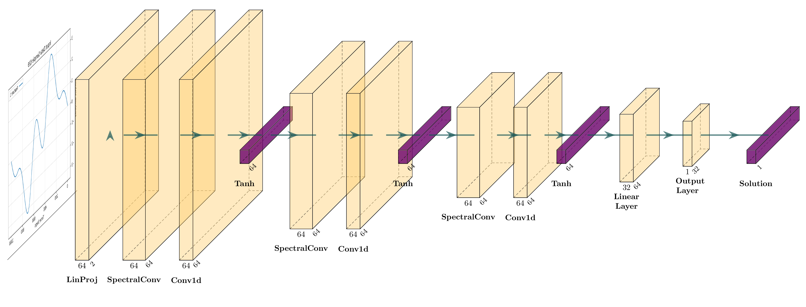
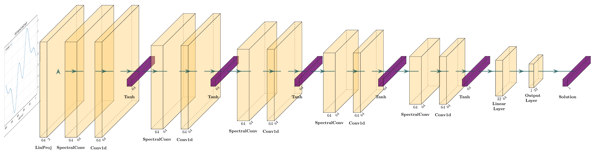
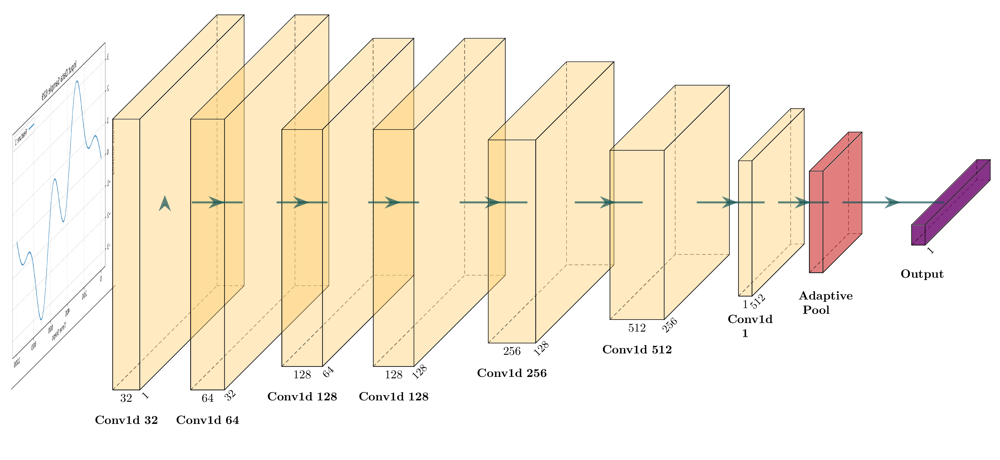
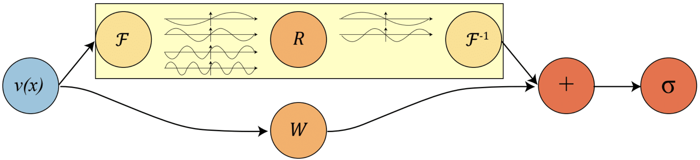
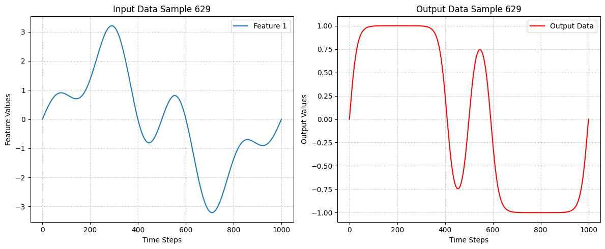
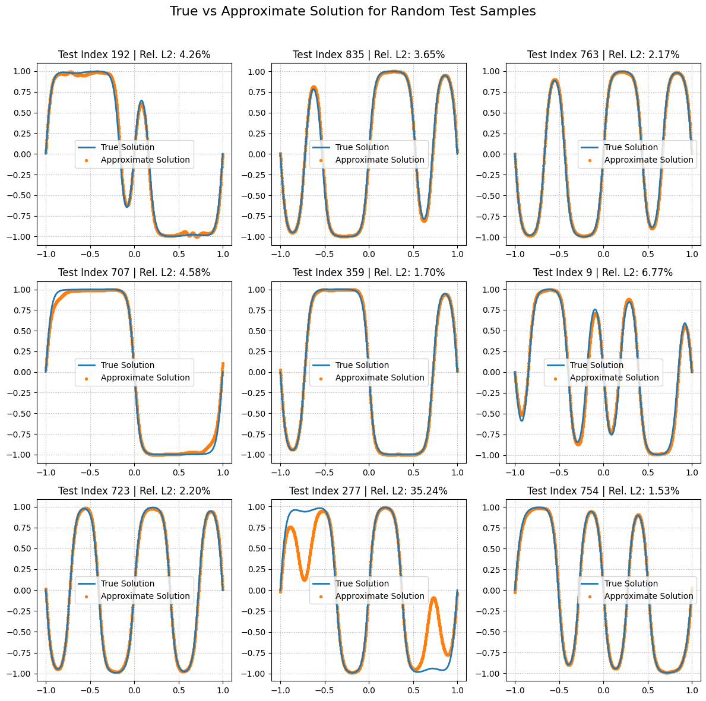
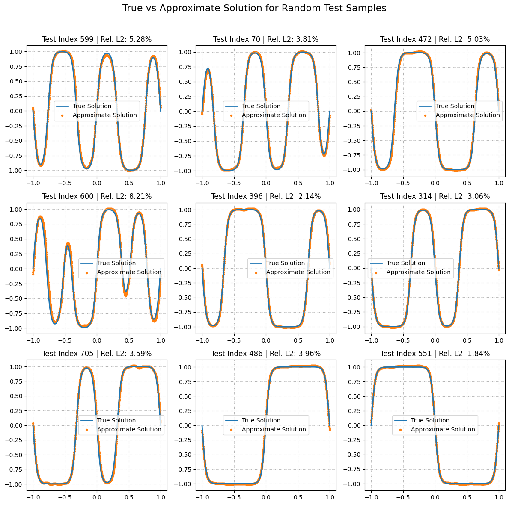
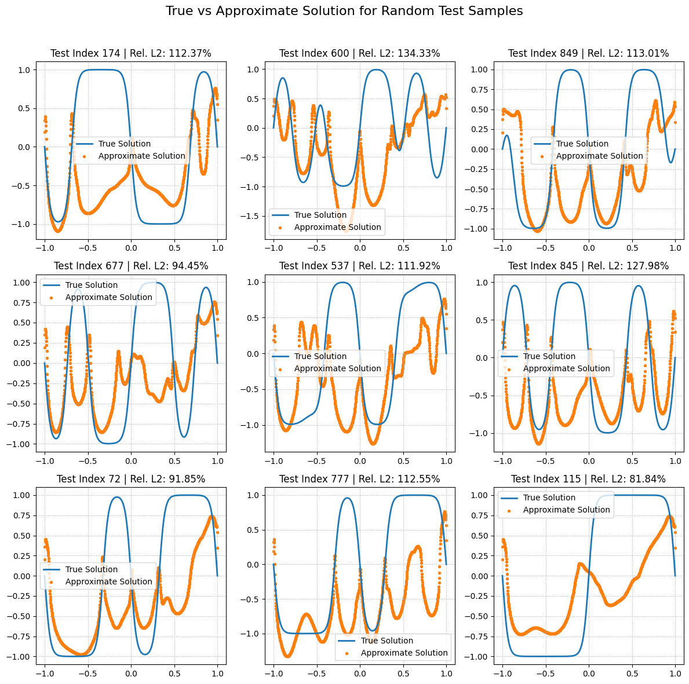
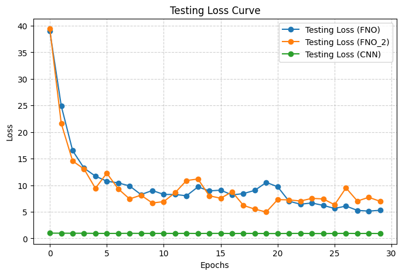

<div align="center">
  
</div>

<div align="center">
  
</div>

<div align="center">
  
</div>

# Fourier Neural Operators (FNOs) for Learning the 1D Allen Cahn Equation

Partial Differential Equations (PDEs) are mathematical equations that involve multiple independent variables, their partial derivatives, and an unknown function. They describe how a quantity changes with respect to several variables and are fundamental in modeling various physical, engineering, and natural phenomena, such as heat conduction, wave propagation, fluid dynamics, electromagnetism, and quantum mechanics.


## Table of Contents

- [Fourier-Neural-Operator](#fourier-neural-operator)
- [Operator Learning](#operator-learning)
- [Import Libraries](#import-libraries)
- [Fourier Layer](#fourier-layer)
- [Allen-Cahn Equation](#allen---cahn-equation)
- [Data Exploration and Visualization](#data-exploration-and-visualization)
- [FNO1d Model](#fno1d-model)
- [Training the FNO1d Model](#training-the-fno1d-model)
- [Testing FNO1d Model Results](#testing-fno1d-model-results)
- [Fourier Layers](#fourier-layers)
- [FNO2_1d Model](#fno2_1d-model)
- [Training the FNO2_1d Model](#training-the-fno2_1d-model)
- [Testing FNO2_1d Model Results](#testing-fno2_1d-model-results)
- [Convolutional Neural Networks (CNN)](#convolutional-neural-networks-cnn)
  - [CNN Model](#cnn-model)
  - [Training the CNN Model](#training-the-cnn-model)
  - [Testing CNN Model Results](#testing-cnn-model-results)
- [FNO vs CNN](#fno-vs-cnn)
  - [Comparing Metrics](#comparing-metrics)


## Fourier-Neural-Operator
Fourier Neural Operators (FNOs) are a deep learning approach for solving PDEs efficiently by learning function-to-function mappings. Unlike traditional numerical solvers, FNOs operate in the Fourier domain, making them significantly faster and more scalable for high-dimensional PDEs.

Traditional methods for solving PDEs, such as Finite Difference Methods (FDM), Finite Element Methods (FEM), and Spectral Methods, can be computationally expensive and struggle with high-dimensional or complex boundary conditions. Deep learning (DL) offers an alternative that can handle these challenges efficiently.

Fourier Neural Operators (FNOs) outperform CNNs and PINNs in learning PDEs by capturing global dependencies through Fourier transforms, enabling faster convergence and superior scalability. Unlike CNNs, which struggle with long-range interactions, and PINNs, which require complex loss tuning, FNOs learn direct mappings between function spaces, making them highly efficient for high-dimensional problems. Their ability to generalize across varying conditions without retraining makes them ideal for real-time applications like fluid dynamics and climate modeling.

## Operator Learning
Operator learning is a machine learning approach used to learn mappings between functions rather than just input-output pairs. It generalizes neural networks to work with infinite-dimensional spaces, such as solutions to differential equations. 
It learns a transformation $G$ that maps one function to another:

$$G: u(x) \to v(x)$$  

where $u(x)$ is the input function and $v(x)$ is the output function.

<div align="center">
  
</div>


PDE solutions function as operators that map between function spaces, taking inputs like initial conditions, boundary conditions, and source terms to produce the corresponding solution. Neural Operators are a class of data-driven models designed to be capable of handling and generalizing across different representations, including varying mesh refinements.

# Import Libraries
```python
import torch
import torch.nn as nn
import os
import numpy as np
from torch.utils.data import DataLoader, TensorDataset
import torch.nn.functional as F
from torch.optim import Adam
import matplotlib.pyplot as plt
from prettytable import PrettyTable
import pandas as pd
```

# Fourier Layer
Since the inputs and outputs of partial differential equations (PDEs) are continuous functions, representing them in Fourier space is often more efficient.

In the spatial domain, convolution corresponds to pointwise multiplication in the Fourier domain. To apply the (global) convolution operator, we first perform a Fourier transform, followed by a linear transformation, and then an inverse Fourier transform.

<div align="center">
  
</div>

The Fourier layer just consists of three steps:

1. Fourier transform (using FFT) $F$

2. Linear transform on the lower Fourier modes $R$

3. Inverse Fourier transform $F^(-1)$


The SpectralConv1d (or Fourier layer) is a specialized layer designed to perform convolution in the Fourier domain rather than in the spatial domain.

```python

class SpectralConv1d(nn.Module):
    def __init__(self, in_channels, out_channels, modes1):
        super(SpectralConv1d, self).__init__()

        """
        1D Fourier layer: It applies FFT, performs a learnable transformation in the frequency domain,
        and then applies the inverse FFT to bring the data back to the spatial domain.
        """

        # Input and output channels
        self.in_channels = in_channels
        self.out_channels = out_channels

        # Fourier modes
        self.modes1 = modes1

        # Scaling factor
        self.scale = (1 / (in_channels * out_channels))

        # Learnable weight parameters (complex numbers) for the Fourier modes
        self.weights1 = nn.Parameter(self.scale * torch.rand(in_channels, out_channels, self.modes1, dtype=torch.cfloat))

    def compl_mul1d(self, input, weights):
        """
        Performs complex multiplication between input Fourier coefficients and learnable weights.
        Uses Einstein summation notation for efficient tensor multiplication.

        Args:
            input: Fourier-transformed input tensor of shape (batch, in_channels, frequency modes)
            weights: Learnable weight tensor of shape (in_channels, out_channels, frequency modes)

        Returns:
            Tensor of shape (batch, out_channels, frequency modes)
        """
        return torch.einsum("bix,iox->box", input, weights)

    def forward(self, x):
        """
        Forward pass of the Spectral Convolution Layer.
        1. Apply FFT to transform input to frequency domain.
        2. Multiply the first 'modes1' Fourier coefficients with learnable weights.
        3. Apply inverse FFT to transform back to spatial domain.

        Args:
            x: Input tensor of shape (batch_size, in_channels, number of grid points)

        Returns:
            Transformed tensor of the same shape as input.
        """

        batchsize = x.shape[0]  # Extract batch size

        # Step 1: Compute the Fourier Transform (Real FFT) to get frequency components
        x_ft = torch.fft.rfft(x)

        # Step 2: Create an output tensor for storing transformed Fourier coefficients
        out_ft = torch.zeros(batchsize, self.out_channels, x.size(-1) // 2 + 1, device=x.device, dtype=torch.cfloat)

        # Step 3: Apply the learnable spectral convolution on the first 'modes1' Fourier coefficients
        out_ft[:, :, :self.modes1] = self.compl_mul1d(x_ft[:, :, :self.modes1], self.weights1)

        # Step 4: Perform the Inverse Fourier Transform to return to the spatial domain
        x = torch.fft.irfft(out_ft, n=x.size(-1))

        return x
```
# Allen - Cahn Equation
The Allen-Cahn equation is a reaction-diffusion partial differential equation (PDE) used to model phase separation in multi-phase systems.

$$u_t = \Delta u - ϵ^2 u (u^2 - 1),\quad u\in\mathbb{R}×\mathbb{R_{>0}}$$

# Data Exploration and Visualization
```python
from google.colab import drive
drive.mount('/content/drive')
```
```python
torch.manual_seed(0)
np.random.seed(0)
```
```python
# Number of training samples to be used
n_train = 100

# Load the input data from a NumPy file and convert it to a PyTorch tensor
# This file contains the initial conditions and spatial coordinates
x_data = torch.from_numpy(np.load("/content/drive/MyDrive/1D_Allen-Cahn/AC_data_input.npy")).type(torch.float32)

# Load the output data from a NumPy file and convert it to a PyTorch tensor
# This file contains the solution of the equation at a later timestep
y_data = torch.from_numpy(np.load("/content/drive/MyDrive/1D_Allen-Cahn/AC_data_output.npy")).type(torch.float32)

# Swap the first and second channels in the input tensor
temporary_tensor = torch.clone(x_data[:, :, 0])
x_data[:, :, 0] = x_data[:, :, 1]
x_data[:, :, 1] = temporary_tensor

# Split the dataset into training and testing sets
input_function_train = x_data[:n_train, :]
output_function_train = y_data[:n_train, :]

input_function_test = x_data[n_train:, :]
output_function_test = y_data[n_train:, :]

batch_size = 10

#DataLoader for training data
training_set = DataLoader(TensorDataset(input_function_train, output_function_train), batch_size=batch_size, shuffle=True)

# DataLoader for testing data
testing_set = DataLoader(TensorDataset(input_function_test, output_function_test), batch_size=batch_size, shuffle=False)
```
```python
# Load the datasets
input_data = x_data
output_data = y_data

# Print dataset shapes
print(f"Input Data Shape: {input_data.shape}")  
print(f"Output Data Shape: {output_data.shape}") 

# Check for time steps
num_samples = input_data.shape[0]
time_steps = input_data.shape[1] if len(input_data.shape) > 1 else 1
num_features = input_data.shape[2] if len(input_data.shape) > 2 else 1

print(f"Number of Samples: {num_samples}")
print(f"Time Steps: {time_steps}")
print(f"Number of Features in Input: {num_features}")

# Visualize sample inputs and outputs
sample_idx = np.random.randint(0, num_samples)  # Select a random sample

plt.figure(figsize=(12, 5))

# Plot Input Data
plt.subplot(1, 2, 1)
for feature in range(num_features):
    if feature == 1:  # Skip Feature 2 (index 1)
        continue
    plt.plot(range(time_steps), input_data[sample_idx, :, feature], label=f'Feature {feature+1}')
plt.title(f'Input Data Sample {sample_idx}')
plt.xlabel('Time Steps')
plt.ylabel('Feature Values')
plt.legend()
plt.grid(True, linestyle=':')


# Plot Output Data
plt.subplot(1, 2, 2)
plt.plot(range(time_steps), output_data[sample_idx, :], label='Output Data', color='r')
plt.title(f'Output Data Sample {sample_idx}')
plt.xlabel('Time Steps')
plt.ylabel('Output Values')
plt.legend()
plt.grid(True, linestyle=':')

plt.tight_layout()
plt.show()
```
Sample Output:
```
Input Data Shape: torch.Size([1000, 1001, 2])
Output Data Shape: torch.Size([1000, 1001])
Number of Samples: 1000
Time Steps: 1001
Number of Features in Input: 2
```
<div align="center">
  
</div>


# FNO1d Model

```python
# Define the Fourier Neural Operator (FNO) for 1D problems
class FNO1d(nn.Module):
    def __init__(self, modes, width):
        super(FNO1d, self).__init__()

        """
        The overall structure of the Fourier Neural Operator (FNO):
        1. Lift the input to a higher-dimensional space using `self.linear_p`.
        2. Apply multiple layers of Fourier-based convolution (`SpectralConv1d`).
        3. Apply linear transformations (`Conv1d`) after each Fourier layer.
        4. Project the output to the desired final dimension (`self.linear_q` and `self.output_layer`).

        Input:  (batch_size, x=s, c=2) -> initial condition and spatial coordinate (u0(x), x)
        Output: (batch_size, x=s, c=1) -> solution at a later time step
        """

        # Number of Fourier modes 
        self.modes1 = modes

        # Number of channels
        self.width = width

        self.padding = 1

        # Initial linear layer to lift the input dimension
        self.linear_p = nn.Linear(2, self.width)

        # Define 3 Fourier convolution layers (SpectralConv1d)
        # Each layer performs spectral convolution to capture global dependencies
        self.spect1 = SpectralConv1d(self.width, self.width, self.modes1)
        self.spect2 = SpectralConv1d(self.width, self.width, self.modes1)
        self.spect3 = SpectralConv1d(self.width, self.width, self.modes1)

        # Define 1x1 convolution layers to refine local features after each Fourier layer
        self.lin0 = nn.Conv1d(self.width, self.width, 1) 
        self.lin1 = nn.Conv1d(self.width, self.width, 1) 
        self.lin2 = nn.Conv1d(self.width, self.width, 1) 

        # Final linear layers to project to the output dimension
        self.linear_q = nn.Linear(self.width, 32)   
        self.output_layer = nn.Linear(32, 1)        

        # Activation function (Tanh) 
        self.activation = torch.nn.Tanh()

    def fourier_layer(self, x, spectral_layer, conv_layer):
        return self.activation(spectral_layer(x) + conv_layer(x))

    def linear_layer(self, x, linear_transformation):
        return self.activation(linear_transformation(x))

    def forward(self, x):
        """
        Steps:
        1. Lift the input to a higher-dimensional space.
        2. Apply spectral convolution layers followed by linear transformations.
        3. Project the output to the final shape.
        """

        # Step 1
        x = self.linear_p(x)

        # Permute dimensions to match (batch, channels, grid_points) for Conv1D
        x = x.permute(0, 2, 1)  # Shape: (batch_size, width, grid_points)

        # Step 2
        x = self.fourier_layer(x, self.spect1, self.lin0)
        x = self.fourier_layer(x, self.spect2, self.lin1)
        x = self.fourier_layer(x, self.spect3, self.lin2)

        # Permute back to (batch, grid_points, width) for the final linear layers
        x = x.permute(0, 2, 1)

        # Step 3
        x = self.linear_layer(x, self.linear_q)  # Reduce dimension to 32
        x = self.output_layer(x)  # Final projection to 1D output

        return x  
```

# Training the FNO1d Model

The below script includes:
- Training with Adam optimizer and StepLR scheduler for learning rate adjustment.
- Evaluation metrics:
  - Mean Squared Error (MSE)
  - Mean Absolute Error (MAE)
  - Root Mean Squared Error (RMSE)
  - R² Score (Coefficient of Determination)
  - Relative L2 Error (%)
- Training and testing results are displayed in a table format for better interpretability.

```python
learning_rate = 0.001
epochs = 30
step_size = 50
gamma = 0.5
```

```python
modes = 16
width = 64
```
The model is initialized and then trained using the specified hyperparameters. 
```python
fno = FNO1d(modes, width)
```

```python
optimizer = Adam(fno.parameters(), lr=learning_rate, weight_decay=1e-5)

scheduler = torch.optim.lr_scheduler.StepLR(optimizer, step_size=step_size, gamma=gamma)

# Loss function
mse_loss_fn = torch.nn.MSELoss()
mae_loss_fn = torch.nn.L1Loss()

train_mse_history = []
train_mae_history = []
train_rmse_history = []

test_mse_history = []
test_mae_history = []
test_r2_history = []
test_rmse_history = []
test_relative_l2_history = []

freq_print = 1

# Training Loop
for epoch in range(epochs):
    fno.train()  
    train_mse, train_mae, train_rmse = 0.0, 0.0, 0.0 

    # Loop over batches in the training set
    for step, (input_batch, output_batch) in enumerate(training_set):
        optimizer.zero_grad()  # Reset gradients

        # Get predictions
        output_pred_batch = fno(input_batch).squeeze(2)

        loss_mse = mse_loss_fn(output_pred_batch, output_batch)
        loss_mse.backward()  # Backpropagation

        optimizer.step()  # Update model parameters

        # Compute additional training metrics
        loss_mae = mae_loss_fn(output_pred_batch, output_batch) 
        loss_rmse = torch.sqrt(loss_mse)

        train_mse += loss_mse.item()
        train_mae += loss_mae.item()
        train_rmse += loss_rmse.item()

    train_mse /= len(training_set)
    train_mae /= len(training_set)
    train_rmse /= len(training_set)

    # Store training losses
    train_mse_history.append(train_mse)
    train_mae_history.append(train_mae)
    train_rmse_history.append(train_rmse)

    # Update learning rate
    scheduler.step()

    # Evaluation on the test set
    fno.eval() 
    test_mse, test_mae, test_rmse, test_r2, test_relative_l2 = 0.0, 0.0, 0.0, 0.0, 0.0

    with torch.no_grad():
        for step, (input_batch, output_batch) in enumerate(testing_set):
            output_pred_batch = fno(input_batch).squeeze(2)

            mse = mse_loss_fn(output_pred_batch, output_batch)
            mae = mae_loss_fn(output_pred_batch, output_batch)
            rmse = torch.sqrt(mse)

            relative_l2 = (torch.mean((output_pred_batch - output_batch) ** 2) / torch.mean(output_batch ** 2)) ** 0.5 * 100

            ss_total = torch.sum((output_batch - torch.mean(output_batch)) ** 2)
            ss_residual = torch.sum((output_batch - output_pred_batch) ** 2)
            r2_score = 1 - (ss_residual / ss_total)

            # Accumulate test losses
            test_mse += mse.item()
            test_mae += mae.item()
            test_rmse += rmse.item()
            test_relative_l2 += relative_l2.item()
            test_r2 += r2_score.item()

        test_mse /= len(testing_set)
        test_mae /= len(testing_set)
        test_rmse /= len(testing_set)
        test_relative_l2 /= len(testing_set)
        test_r2 /= len(testing_set)

        # Store test losses
        test_mse_history.append(test_mse)
        test_mae_history.append(test_mae)
        test_rmse_history.append(test_rmse)
        test_relative_l2_history.append(test_relative_l2)
        test_r2_history.append(test_r2)

    # Print training and test metrics in a table format
        if epoch % freq_print == 0:
          print(f"\nEpoch: {epoch}")
          print(f"{'Metric':<20}{'Train':<20}{'Test'}")
          print("-" * 60)
          print(f"{'MSE':<20}{train_mse:<20f}{test_mse:.6f}")
          print(f"{'MAE':<20}{train_mae:<20f}{test_mae:.6f}")
          print(f"{'RMSE':<20}{train_rmse:<20f}{test_rmse:.6f}")
          print(f"{'R²':<20}{'-':<20}{test_r2:.6f}")  # R² is only for the test set
          print(f"{'Relative L2 (%)':<20}{'-':<20}{test_relative_l2:.6f}%")  # Only for test
```
Last Iterated Outputs:

```
.
.
.
Epoch: 28
Metric              Train               Test
------------------------------------------------------------
MSE                 0.000729            0.002130
MAE                 0.014293            0.019510
RMSE                0.025856            0.042593
R²                  -                   0.996894
Relative L2 (%)     -                   5.143578%

Epoch: 29
Metric              Train               Test
------------------------------------------------------------
MSE                 0.000624            0.002351
MAE                 0.013763            0.019859
RMSE                0.024232            0.043836
R²                  -                   0.996572
Relative L2 (%)     -                   5.293022%
```

To further understand the model architecture, we summarize its structure using the function below. This summary provides insights into the number of layers, parameters, and computational complexity, helping evaluate the impact of architectural modifications on model performance.

```python
def model_summary(model):
    table = PrettyTable(["Modules", "Parameters"])
    total_params = 0
    for name, parameter in model.named_parameters():
        if not parameter.requires_grad: continue
        params = parameter.numel()
        table.add_row([name, params])
        total_params+=params
    print(table)
    print(f"Total Trainable Params: {total_params}")
    return total_params
    total_params+=params
    print(table)
    print(f'Total Trainable Params: {total_params}')
    return total_params
```

```python
model_summary(fno)
```

```
+---------------------+------------+
|       Modules       | Parameters |
+---------------------+------------+
|   linear_p.weight   |    128     |
|    linear_p.bias    |     64     |
|   spect1.weights1   |   65536    |
|   spect2.weights1   |   65536    |
|   spect3.weights1   |   65536    |
|     lin0.weight     |    4096    |
|      lin0.bias      |     64     |
|     lin1.weight     |    4096    |
|      lin1.bias      |     64     |
|     lin2.weight     |    4096    |
|      lin2.bias      |     64     |
|   linear_q.weight   |    2048    |
|    linear_q.bias    |     32     |
| output_layer.weight |     32     |
|  output_layer.bias  |     1      |
+---------------------+------------+
Total Trainable Params: 211393
211393
```

# Testing FNO1d Model Results

In the following section, we explore the visual results of the Fourier Neural Operator (FNO) model on the test dataset. The predicted outputs are compared with the ground truth, providing insights into the model's ability to learn and generalize patterns in 1D regression tasks.  

These visualizations highlight the model's performance by showcasing the predicted and actual values, helping assess accuracy and error distribution across different test samples.  

The following plots display the model's predictions:

<div align="center">
  
</div>


# Fourier Layers

To evaluate how the **Fourier Neural Operator's (FNO)** predictive capability is affected, we developed a new model, **FNO2_1d**, using the same hyperparameters but with additional **Fourier layers**. By increasing the model depth, we aim to assess whether the extra layers enhance accuracy and generalization in 1D regression tasks.  

The following sections compare the performance of **FNO1d** and **FNO2_1d**, analyzing their predictions and error metrics on the test dataset.

```python
fno_2 = FNO2_1d(modes, width)
```

```python
model_summary(fno_2)
```

```
+---------------------+------------+
|       Modules       | Parameters |
+---------------------+------------+
|   linear_p.weight   |    128     |
|    linear_p.bias    |     64     |
|   spect1.weights1   |   65536    |
|   spect2.weights1   |   65536    |
|   spect3.weights1   |   65536    |
|   spect4.weights1   |   65536    |
|   spect5.weights1   |   65536    |
|     lin0.weight     |    4096    |
|      lin0.bias      |     64     |
|     lin1.weight     |    4096    |
|      lin1.bias      |     64     |
|     lin2.weight     |    4096    |
|      lin2.bias      |     64     |
|     lin3.weight     |    4096    |
|      lin3.bias      |     64     |
|     lin4.weight     |    4096    |
|      lin4.bias      |     64     |
|   linear_q.weight   |    2048    |
|    linear_q.bias    |     32     |
| output_layer.weight |     32     |
|  output_layer.bias  |     1      |
+---------------------+------------+
Total Trainable Params: 350785
350785
```
FNO2_1d Model Predictions:

<div align="center">
  
</div>

As we can see, increasing the number of **Fourier layers** did not significantly improve the model's predictive ability. While the additional layers slightly influenced the results, the overall effect on accuracy and generalization was minimal. This suggests that simply increasing the depth of the Fourier layers may not always lead to better performance and that other factors, such as data quality, regularization, or alternative architectural modifications, might play a more crucial role in enhancing the model’s predictions.


# Convolutional Neural Networks (CNN)

In this section, we investigate the use of Convolutional Neural Networks (CNNs) for solving the Allen-Cahn equation.

The goal is to evaluate how two model architectures (FNOs & CNNs) perform when applied to the same problem, focusing on their ability to approximate solutions to the Allen-Cahn equation effectively.

## CNN Model

```python
class CNNModel(nn.Module):
    def __init__(self, input_channels=1, output_channels=1):
        super(CNNModel, self).__init__()

        # Expanded number of layers and increased the number of filters
        self.conv1 = nn.Conv1d(input_channels, 32, kernel_size=3, padding=1)
        self.conv2 = nn.Conv1d(32, 64, kernel_size=3, padding=1)
        self.conv3 = nn.Conv1d(64, 128, kernel_size=3, padding=1)  
        self.conv4 = nn.Conv1d(128, 128, kernel_size=3, padding=1) 
        self.conv5 = nn.Conv1d(128, 256, kernel_size=3, padding=1) 
        self.conv6 = nn.Conv1d(256, 512, kernel_size=3, padding=1)  

        self.conv7 = nn.Conv1d(512, output_channels, kernel_size=3, padding=1)  # Output layer

        # Adaptive average pooling to adjust the output size to 1001
        self.pool = nn.AdaptiveAvgPool1d(1001)

        self.relu = nn.ReLU()

    def forward(self, x):
        # Ensure x is 3D: [batch_size, channels, sequence_length]
        if len(x.shape) == 4:  # Check for extra dimension
            x = x.squeeze(-1)  # Remove the extra dimension

        x = self.relu(self.conv1(x))
        x = self.relu(self.conv2(x))
        x = self.relu(self.conv3(x))
        x = self.relu(self.conv4(x))
        x = self.relu(self.conv5(x))
        x = self.relu(self.conv6(x))
        x = self.conv7(x)  # Final convolution layer

        x = self.pool(x)  # Resize to 1001 length if necessary

        return x
```

## Training the CNN Model

```python
train_mse_history = []
train_mae_history = []
train_rmse_history = []
train_relative_l2_history = []

test_mse_history = []
test_mae_history = []
test_rmse_history = []
test_relative_l2_history = []  
test_r2_history = []
```

```python
import torch.optim as optim

device = torch.device("cuda" if torch.cuda.is_available() else "cpu")

cnn_model = CNNModel(input_channels=2, output_channels=1).to(device)

# Define optimizer and scheduler
optimizer = optim.Adam(cnn_model.parameters(), lr=learning_rate, weight_decay=1e-5)
scheduler = torch.optim.lr_scheduler.StepLR(optimizer, step_size=step_size, gamma=gamma)

# Loss functions
mse_loss_fn = nn.MSELoss()
mae_loss_fn = nn.L1Loss()

# Training Loop
for epoch in range(epochs):
    cnn_model.train()
    train_mse, train_mae, train_rmse, train_relative_l2 = 0.0, 0.0, 0.0, 0.0

    for step, (input_batch, output_batch) in enumerate(training_set):
        optimizer.zero_grad()

        input_batch = input_batch.view(input_batch.shape[0], 2, -1)  # Ensure correct shape
        output_pred_batch = cnn_model(input_batch).squeeze(1)

        # Compute loss values
        loss_mse = mse_loss_fn(output_pred_batch, output_batch)
        loss_mse.backward()
        optimizer.step()

        loss_mae = mae_loss_fn(output_pred_batch, output_batch)
        loss_rmse = torch.sqrt(loss_mse)

        relative_l2 = torch.norm(output_pred_batch - output_batch) / torch.norm(output_batch)

        train_mse += loss_mse.item()
        train_mae += loss_mae.item()
        train_rmse += loss_rmse.item()
        train_relative_l2 += relative_l2.item()

    train_mse /= len(training_set)
    train_mae /= len(training_set)
    train_rmse /= len(training_set)
    train_relative_l2 /= len(training_set)

    train_mse_history.append(train_mse)
    train_mae_history.append(train_mae)
    train_rmse_history.append(train_rmse)
    train_relative_l2_history.append(train_relative_l2)

    scheduler.step()

    # Evaluation
    cnn_model.eval()
    test_mse, test_mae, test_rmse, test_r2, test_relative_l2 = 0.0, 0.0, 0.0, 0.0, 0.0

    with torch.no_grad():
        for step, (input_batch, output_batch) in enumerate(testing_set):
            input_batch = input_batch.view(input_batch.shape[0], 2, -1)  
            output_pred_batch = cnn_model(input_batch).squeeze(1)

            mse = mse_loss_fn(output_pred_batch, output_batch)
            mae = mae_loss_fn(output_pred_batch, output_batch)
            rmse = torch.sqrt(mse)

            # Calculate Relative L2 Error
            relative_l2 = torch.norm(output_pred_batch - output_batch) / torch.norm(output_batch)

            ss_total = torch.sum((output_batch - torch.mean(output_batch)) ** 2)
            ss_residual = torch.sum((output_batch - output_pred_batch) ** 2)
            r2_score = 1 - (ss_residual / ss_total)

            test_mse += mse.item()
            test_mae += mae.item()
            test_rmse += rmse.item()
            test_relative_l2 += relative_l2.item()
            test_r2 += r2_score.item()

        # Average out the metrics
        test_mse /= len(testing_set)
        test_mae /= len(testing_set)
        test_rmse /= len(testing_set)
        test_relative_l2 /= len(testing_set)
        test_r2 /= len(testing_set)

        test_mse_history.append(test_mse)
        test_mae_history.append(test_mae)
        test_rmse_history.append(test_rmse)
        test_relative_l2_history.append(test_relative_l2)
        test_r2_history.append(test_r2)

   # Print training and test metrics in a table format
        if epoch % freq_print == 0:
          print(f"\nEpoch: {epoch}")
          print(f"{'Metric':<20}{'Train':<20}{'Test'}")
          print("-" * 60)
          print(f"{'MSE':<20}{train_mse:<20f}{test_mse:.6f}")
          print(f"{'MAE':<20}{train_mae:<20f}{test_mae:.6f}")
          print(f"{'RMSE':<20}{train_rmse:<20f}{test_rmse:.6f}")
          print(f"{'R²':<20}{'-':<20}{test_r2:.6f}")  # R² is only for the test set
          print(f"{'Relative L2 (%)':<20}{'-':<20}{test_relative_l2:.6f}%")  # Only for test
```

Last Iterated Outputs:

```
.
.
.
Epoch: 28
Metric              Train               Test
------------------------------------------------------------
MSE                 0.517000            0.606153
MAE                 0.606281            0.644920
RMSE                0.718095            0.776237
R²                  -                   0.115099
Relative L2 (%)     -                   0.937226%

Epoch: 29
Metric              Train               Test
------------------------------------------------------------
MSE                 0.501254            0.584649
MAE                 0.597721            0.657924
RMSE                0.707504            0.762959
R²                  -                   0.146385
Relative L2 (%)     -                   0.921221%
```

```python
model_summary(cnn_model)
```

```
+--------------+------------+
|   Modules    | Parameters |
+--------------+------------+
| conv1.weight |    192     |
|  conv1.bias  |     32     |
| conv2.weight |    6144    |
|  conv2.bias  |     64     |
| conv3.weight |   24576    |
|  conv3.bias  |    128     |
| conv4.weight |   49152    |
|  conv4.bias  |    128     |
| conv5.weight |   98304    |
|  conv5.bias  |    256     |
| conv6.weight |   393216   |
|  conv6.bias  |    512     |
| conv7.weight |    1536    |
|  conv7.bias  |     1      |
+--------------+------------+
Total Trainable Params: 574241
574241
```

CNN Model Predictions:

<div align="center">
  
</div>


# FNO vs CNN

In this section, we compare the performance of Fourier Neural Operators (FNO) and Convolutional Neural Networks (CNNs) in solving the Allen-Cahn equation.

## Comparing Metrics

The Testing Loss Curve compares the performance of the FNO, FNO_2, and CNN models over 30 epochs.

<div align="center">
  
</div>


Below is a function that creates a summary table comparing multiple models based on their evaluation metrics. 

| Model Index | Model     | Test MSE  | Test MAE  | Test RMSE | Test R²   | Test Relative L2 (%) | Min Test Loss | Total Parameters |
|------------|----------|-----------|-----------|-----------|-----------|----------------------|---------------|------------------|
| 0          | FNO1d    | $$0.002351$$  | $$0.019859$$  | $$0.043836$$  | $$0.996572$$  | $$5.293022$$             | $$0.002130$$      | $$211393$$           |
| 1          | FNO2_1d  | $$0.003570$$  | $$0.029459$$  | $$0.057029$$  | $$0.994789$$  | $$6.972500$$             | $$0.001887$$      | $$350785$$           |
| 2          | CNNModel | $$0.584649$$  | $$0.657924$$  | $$0.762959$$  | $$0.146385$$  | $$0.921221$$             | $$0.567342$$      | $$574241$$           |


As we can see, FNO1d outperforms both FNO2_1d and CNNModel across all metrics. It achieves the lowest error, highest R² score, and best overall predictive performance. Moreover, adding more Fourier layers in FNO2_1d did not lead to improvements, as its error metrics are slightly worse than FNO1d. The CNN model performs significantly worse than both FNO models, despite having the highest number of parameters.


