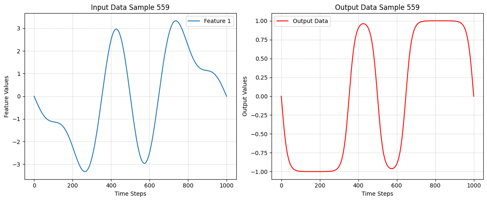

# Fourier Neural Operators (FNOs) for Learning the 1D Allen Cahn Equation

In this project, we focus on learning the **1D Allen–Cahn equation** using a **Fourier neural operator (FNO) model**. The Allen–Cahn equation is a reaction-diffusion PDE that describes phase separation in multi-phase systems:

$$
u_t = \Delta u - ϵ^2 u (u^2 - 1),\quad u\in\mathbb{R}×\mathbb{R_{>0}}
$$

We demonstrate that the FNO outperforms conventional deep learning approaches, specifically a CNN-based model, in terms of accuracy and generalization. By leveraging FNO’s ability to learn mappings in function space, we achieve superior resolution-invariance and improved performance over mesh-dependent deep learning methods.


## Table of Contents

1. [Fourier Neural Operators (FNOs) for Learning the 1D Allen Cahn Equation](#fourier-neural-operators-fnos-for-learning-the-1d-allen-cahn-equation)
2. [Neural Operators for Solving PDEs](#neural-operators-for-solving-pdes)
3. [Fourier Neural Operators (FNOs)](#fourier-neural-operators-fnos)
   - [Fourier Layer](#fourier-layer)
4. [Data Exploration and Visualization](#data-exploration-and-visualization)
5. [Deep Learning Models](#deep-learning-models)
   - [1. FNO1d Model](#1-fno1d-model)
   - [2. Convolutional Neural Networks (CNN) Model](#2-convolutional-neural-networks-cnn)
6. [FNO vs CNN](#fno-vs-cnn)


## Neural Operators for Solving PDEs

Many scientific and engineering problems require solving systems of partial differential equations (PDEs). However, traditional PDE solvers, such as finite element methods (FEM) and finite difference methods (FDM), rely on discretizing the computational domain into a fine mesh, which can be computationally expensive and inefficient.

**Neural operators** offer an alternative approach by leveraging neural networks to learn solution operators for PDEs. Instead of solving PDEs iteratively on a mesh, neural operators take initial or boundary conditions as input and directly produce the solution, akin to an image-to-image transformation.

Unlike standard methods, neural operators are mesh-independent. They can be trained on one discretization and evaluated on another, as they operate in function space rather than learning discrete vectors.

| **Conventional PDE Solvers** | **Neural Operators** |
|-----------------------------|----------------------|
| Solve a single instance at a time | Learn a family of PDEs |
| Require explicit equation formulation | Black-box, data-driven approach |
| Speed-accuracy trade-off based on resolution | Resolution- and mesh-invariant |
| Computationally expensive on fine grids, faster on coarse grids | Slow to train but fast to evaluate |


## Fourier Neural Operators (FNOs)

**Fourier Neural Operators (FNOs)** are a deep learning approach for solving PDEs efficiently by learning function-to-function mappings. Unlike traditional numerical solvers, FNOs operate in the Fourier domain, making them significantly faster and more scalable for high-dimensional PDEs.

Fourier Neural Operators (FNOs) rely on **operator learning**, where we attempt to learn mappings between functions rather than just input-output pairs. It generalizes neural networks to work with infinite-dimensional spaces, such as solutions to differential equations. Particularly, it learns a transformation $G$ that maps one function to another:

$$G: u(x) \to v(x)$$  

where $u(x)$ is the input function and $v(x)$ is the output function.

<div align="center">
  
</div>

PDE solutions function as operators that map between function spaces, taking inputs like initial conditions, boundary conditions, and source terms to produce the corresponding solution. 

### Fourier Layer
Since the inputs and outputs of partial differential equations (PDEs) are continuous functions, representing them in Fourier space is often more efficient.

In the spatial domain, convolution corresponds to pointwise multiplication in the Fourier domain. To apply the (global) convolution operator, we first perform a Fourier transform, followed by a linear transformation, and then an inverse Fourier transform.

<div align="center">
  
</div>

The Fourier layer just consists of three steps:

1. Fourier transform (using FFT) $F$

2. Linear transform on the lower Fourier modes $R$

3. Inverse Fourier transform $F^{-1}$


We incorporate a Fourier Layer in our implementation `SpectralConv1d`designed to perform convolution in the Fourier domain rather than in the spatial domain.


## Data Exploration and Visualization

Our data consists of the initial conditions and mapped solutions. It has the following dimensions:

```python
Input Data Shape: torch.Size([1000, 1001, 2])
Output Data Shape: torch.Size([1000, 1001])
Number of Samples: 1000
Time Steps: 1001
Number of Features in Input: 2
```

<div align="center">
  
</div>


## Deep Learning Models

### 1. FNO1d Model

<div align="center">
  
</div>

Our first model implements a Fourier Neural Operator (FNO) which leverages spectral convolutions to learn integral operators efficiently. The model is constructed using **SpectralConv1d** layers, which perform a Fourier transform, apply learnable weights to selected frequency modes, and then transform back using an inverse Fourier transform. The model consists of three such spectral convolution layers, combined with pointwise **Conv1d** layers for refining local features. The model takes an input of shape **(batch, x, 2)** (initial condition and spatial coordinate) and outputs a prediction **(batch, x, 1)** at a future time step. 

The training process optimizes an **MSE loss function**:  

$$\mathcal{L}{MSE} = \frac{1}{N} \sum{i=1}^{N} (y_i - \hat{y}_i)^2$$

where:
- $N$ is the number of samples,
- $y_i$ is the true value (ground truth) for sample $i$,
- $\hat{y}_i$ is the predicted value for sample $i$.

We use **Adam optimizer** with a **learning rate of 0.001**, **weight decay of \(1e-5\)**, and **StepLR scheduler** with a **step size of 50** and **gamma of 0.5**. Performance metrics such as **MSE, MAE, RMSE, R² score, and relative L2 error** are tracked throughout the training and evaluation process. The model is trained for **30 epochs** with periodic evaluation on a test set.

We summarize our model's structure using a custom made function `model_summary(model)`:
```
+---------------------+------------+
|       Modules       | Parameters |
+---------------------+------------+
|   linear_p.weight   |    128     |
|    linear_p.bias    |     64     |
|   spect1.weights1   |   65536    |
|   spect2.weights1   |   65536    |
|   spect3.weights1   |   65536    |
|     lin0.weight     |    4096    |
|      lin0.bias      |     64     |
|     lin1.weight     |    4096    |
|      lin1.bias      |     64     |
|     lin2.weight     |    4096    |
|      lin2.bias      |     64     |
|   linear_q.weight   |    2048    |
|    linear_q.bias    |     32     |
| output_layer.weight |     32     |
|  output_layer.bias  |     1      |
+---------------------+------------+
Total Trainable Params: 211393
211393
```

#### Test Prediction

The following plots display random samples of the model's predictions to visually asses performance and accuracy:

<div align="center">
  
</div>


#### Adding More Fourier Layers

To evaluate how the **Fourier Neural Operator's (FNO)** predictive capability is affected, we developed a new model, **FNO2_1d**, using the same hyperparameters but with additional **Fourier layers**. By increasing the model depth, we aim to assess whether the extra layers enhance accuracy and generalization.  


<div align="center">
  
</div>


Again, we display the updated model's predictions to visually assess performance:

<div align="center">
  
</div>

We can see that increasing the number of **Fourier layers** did not significantly improve the model's predictive ability. While the additional layers slightly influenced the results, the overall effect on accuracy and generalization was minimal. This suggests that simply increasing the depth of the Fourier layers may not always lead to better performance and that other factors, such as data quality, regularization, or alternative architectural modifications, might play a more crucial role in enhancing the model’s predictions.


## 2. Convolutional Neural Networks (CNN)

Next, we investigate the use of Convolutional Neural Networks (CNNs) for solving the Allen-Cahn equation.

The goal is to evaluate how two model architectures (FNOs & CNNs) perform when applied to the same problem, focusing on their ability to approximate solutions to the Allen-Cahn equation effectively.


<div align="center">
  
</div>


Our **1D CNN model** is designed for sequence-based regression tasks. It consists of **seven convolutional layers** with increasing filter sizes (from 32 to 512), followed by an **adaptive average pooling layer** to ensure a fixed output size of 1001. Each convolutional layer applies a **ReLU activation**, except for the final output layer. The model takes **two input channels** (e.g., initial conditions and spatial coordinates) and outputs a **single-channel prediction**. 

The optimizer used is **Adam** with a learning rate of **0.001** and **weight decay of \(1e-5\)**. A **StepLR scheduler** reduces the learning rate every **50 epochs** by a factor of **0.5**. The **MSE loss function** is minimized, while additional metrics such as **MAE, RMSE, R² score, and relative L2 error** are computed during training and evaluation. The model is trained on a **GPU (if available)** and iterates over multiple epochs while storing training and test loss histories for performance tracking.

A simple diagram showcasing the overall architecture can be found below:
```
+--------------+------------+
|   Modules    | Parameters |
+--------------+------------+
| conv1.weight |    192     |
|  conv1.bias  |     32     |
| conv2.weight |    6144    |
|  conv2.bias  |     64     |
| conv3.weight |   24576    |
|  conv3.bias  |    128     |
| conv4.weight |   49152    |
|  conv4.bias  |    128     |
| conv5.weight |   98304    |
|  conv5.bias  |    256     |
| conv6.weight |   393216   |
|  conv6.bias  |    512     |
| conv7.weight |    1536    |
|  conv7.bias  |     1      |
+--------------+------------+
Total Trainable Params: 574241
574241
```

The CNN model predictions did not display optimal prediction capabilities:

<div align="center">
  
</div>


## FNO vs CNN

We numerically compare the performance of Fourier Neural Operators (FNO) and Convolutional Neural Networks (CNNs) in solving the Allen-Cahn equation.

The testing loss curve compares the training performance of the FNO, FNO_2, and CNN models over 30 epochs.

<div align="center">
  
</div>

Computed error metrics can be found below:

| Model Index | Model     | Test MSE  | Test MAE  | Test RMSE | Test R²   | Test Relative L2 (%) | Min Test Loss | Total Parameters |
|------------|----------|-----------|-----------|-----------|-----------|----------------------|---------------|------------------|
| 0          | FNO1d    | $$0.002351$$  | $$0.019859$$  | $$0.043836$$  | $$0.996572$$  | $$5.293022$$             | $$0.002130$$      | $$211393$$           |
| 1          | FNO2_1d  | $$0.003570$$  | $$0.029459$$  | $$0.057029$$  | $$0.994789$$  | $$6.972500$$             | $$0.001887$$      | $$350785$$           |
| 2          | CNNModel | $$0.584649$$  | $$0.657924$$  | $$0.762959$$  | $$0.146385$$  | $$0.921221$$             | $$0.567342$$      | $$574241$$           |

As we can see, FNO1d outperforms both FNO2_1d and CNNModel across all metrics. It achieves the lowest error, highest R² score, and best overall predictive performance. Moreover, adding more Fourier layers in FNO2_1d did not lead to improvements, as its error metrics are slightly worse than FNO1d. The CNN model performs significantly worse than both FNO models, despite having the highest number of parameters.


